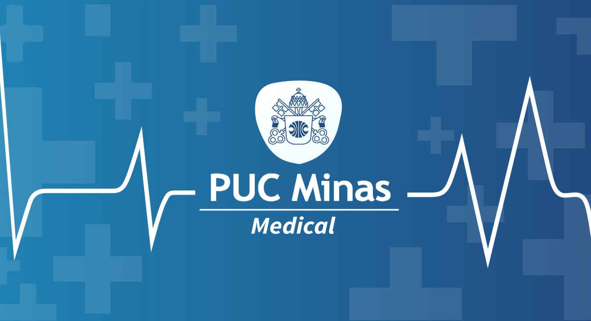
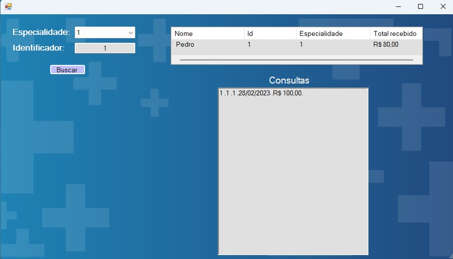

# PucMinasMedical
Trabalho feito em C# / Windows Forms para disciplina de Algoritmo e Estrutura de Dados que visa escalonar os dados de uma cliníca e armazernar em uma estrutura de dados afim de gerar dados significativos.

